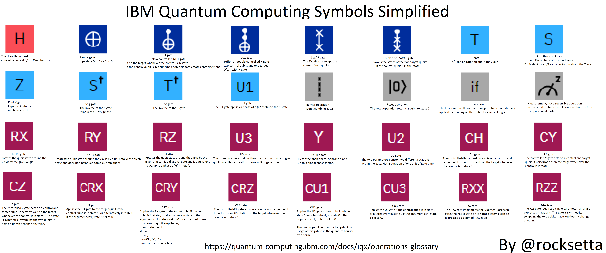

# My examples of Quantum Computing


Started Nov 5th, 2020
# version 0.0.1 

## This github is at:    
https://github.com/hpssjellis/my-examples-for-quantum-computing


## This Repo website is at:  
https://hpssjellis.github.io/my-examples-for-quantum-computing/public/index.html


## Gitpod of this Github 
(right click open in new window, needs you to have a github login) 
https://gitpod.io/#github.com/hpssjellis/my-examples-for-quantum-computing

or load a pre-made snapshot (faster to load but older) 
Made Nov 23th, 2020

[](https://gitpod.io/#snapshot/9df05905-611b-4695-9334-8c871d3244d8)


## latest

Batch of tweets: 


https://twitter.com/rocksetta/status/1312604679017099271?s=19


As of Nov10th, I am now concentrating on https://pennylane.ai/

PennylaneAI github at
https://github.com/PennyLaneAI/PennyLane


PennylaneAI qml github at
https://github.com/PennyLaneAI/qml   


PennyLaneAI Interactive Strawberry fields   https://strawberryfields.ai/interactive/


# Installation


# my work is in the Rocksetta folder
[rocksetta](rocksetta)

```
python3 file.py

```


# pennylaneAI QML demos now works

When the gitpod is running go the the folder pennylanai --> qml-demos and run

```
python3 tutorial-filename.py

```

The folder is at [pennylaneai/qml-demos/](pennylaneai/qml-demos/)


# Demos

these examples were for Tensorflow Quantum which still work, but I am now working in the Pennylane folder

run the examples by going to the apropriate folder and typing "python3 file.py" such as

```
python3 a01-mnist-small.py

```


Testing to see if these work: Mnist full should take about 20 min or more.
```
python3 a02-mnist-full.py

```
Testing

```
python3 a03-gradients.py
python3 a04-hello-many-worlds.py
python3 a05-qcnn.py

```
Note: a tf.keras.utils.plot_model command is not working, for the last 2 programs hello and qcnn. I will be looking into it.


To make the above python program I converted the ipython notebook by opening up the 
folders quantum --> docs --> tutorials and typing

```

jupyter nbconvert --to script mnist.ipynb

```
It will output mnist.txt and you can change it to mnist.py. A few of the first commands need to be changed.


##  Resources


# dwave
dwavesystems  
https://www.dwavesys.com/

Login to dWave Leap  
https://cloud.dwavesys.com/leap/login/
 
dWave Community  
https://support.dwavesys.com/hc/en-us/community/topics


# TFQ Tensorflow Quantum

https://www.tensorflow.org/quantum/overview


Mnist Google collab

https://www.tensorflow.org/quantum/tutorials/mnist

https://colab.research.google.com/github/tensorflow/quantum/blob/master/docs/tutorials/mnist.ipynb


# IBM Quantum

IBM actual quantum computer. This is live and easy to use!!! 

https://www.ibm.com/quantum-computing

Symbols Explained
https://quantum-computing.ibm.com/docs/iqx/operations-glossary


Simulators:

https://quantumjavascript.app/


First Issue. Q.js is a playground, can't seem to figure out how to make my own javascript pages


https://raw.githubusercontent.com/stewdio/q.js/master/build/q.js


https://github.com/stewdio/q.js


Click on the image to be able to zoom  
[](https://hpssjellis.github.io/tfQuantumJs/public/ibm-quantum-symbols.html)


Something interesting at  https://github.com/google/jax but I have not yet found out if JAX will be useful for me.

```
pip3 install jax

git clone https://github.com/google/jax.git

```

